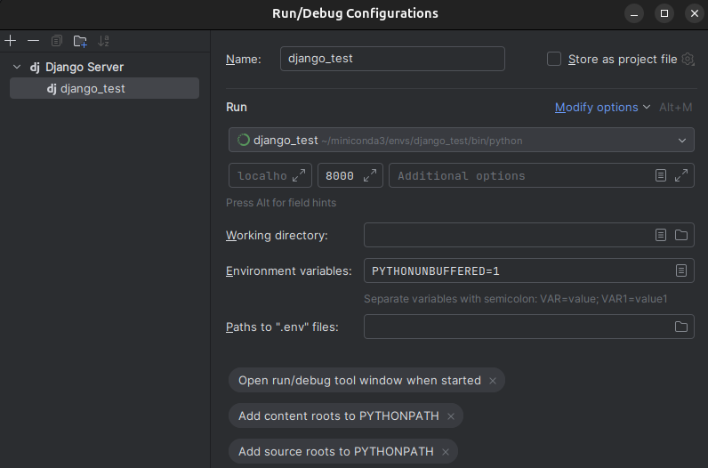

# io2025

### Instrukcje postawienia lokalnej wersji
#### 1. Załóż środowisko lokalne
Tutaj zastosowano condę, można też użyć venv:
```bash
conda create -n django_test python
conda activate django_test

cd ~/PycharmProjects
git clone <link_do_repo> <nazwa_folderu_docelowego>
cd <nazwa_folderu_docelowego>

pip install -r requirements.txt
```
#### 2. Utwórz plik .env i dodaj tam odpowiednie zmienne środowiskowe
```bash
nano .env
############## ZAWARTOŚĆ .env ##############
# SECRET_KEY=<klucz_prywatny>
# UPLOADED_FILES=<katalog_plikow_lokalnych>
############## ZAWARTOŚĆ .env ##############
```
Czyli przykładowo, jeśli mój klucz prywatny to django-insecure-c-!bac#($x2etc, a katalog w którym
chciałbym lokalnie przechowywać pliki wrzucone na stronę testową to /home/janek/PycharmProjects/ocr/media,
to mój plik .env będzie miał następującą treść:
```bash
SECRET_KEY=django-insecure-c-!bac#($x2etc
UPLOADED_FILES=/home/janek/PycharmProjects/ocr/media
```
#### 3. Dodaj .env do swojego .gitignore
Czyli plik .gitignore powinien na którejś linijce zawierać:
```angular2html
(...)
.env
(...)
```
#### 4. (conda) Zmień interpreter swojego projektu w PyCharmie na django_test:

### Instrukcje tworzenia od zera
```bash
conda create -n django_test python
conda activate django_test

pip install -r requirements.txt

django-admin startproject ocr
cd ocr

python manage.py startapp application

mkdir application/templates/application
(...)
```