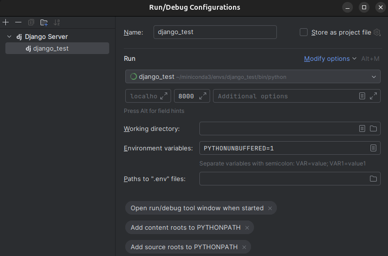

# System OCR

## Instrukcje tworzenia wersji lokalnej
### 1. Załóż środowisko lokalne
Aby poznać swoją wersję CUDA należy uruchomić
```bash
nvidia-smi
```
zarówno na systemiu Windows jak i Linux. Zależnie od wersji
należy dobrać odpowiedną wersję modułów OCR zgodnie z instrukcjami zawartymi w dalszej części README.

Tutaj zastosowano condę, można też użyć venv:
```bash
cd ~/PycharmProjects
git clone <link_do_repo> <nazwa_folderu_docelowego>
cd <nazwa_folderu_docelowego>

conda create -n django_test python=3.12.9
conda activate django_test

# For ReactJS
conda install -c conda-forge nodejs=22.13

# PaddleOCR Cuda <12.6
python -m pip install paddlepaddle-gpu==3.0.0 -i https://www.paddlepaddle.org.cn/packages/stable/cu118/
# Cuda >=12.6
python -m pip install paddlepaddle-gpu==3.0.0 -i https://www.paddlepaddle.org.cn/packages/stable/cu126/

pip install -r requirements.txt

cd frontend && npm install && npm run build

cd ..
```

Utwórz pliki .env i dodaj tam odpowiednie zmienne środowiskowe. Zawartość obu plików .env 
znajduje się na kanale wewnętrznym. Dostosuj strukturę scieżek do systemu operacyjnego.

```bash
cd ocr
nano .env
# (...) uzupełnienie ocr/.env
```

Nieuzupełniona zawartość ocr/.env:
```bash 
SECRET_KEY=
UPLOADED_FILES=
FIREBASE_KEY=
GOOGLE_OAUTH2_CLIENT_ID=
GOOGLE_OAUTH2_CLIENT_SECRET=
GOOGLE_OAUTH2_REDIRECT_URI=
```
Oraz drugi .env:
```bash
cd ../frontend
nano .env
# (...) uzupełnienie frontend/.env
```

Nieuzupełniona zawartość frontend/.env:
```bash
REACT_APP_GOOGLE_OAUTH2_CLIENT_ID=
REACT_APP_FIREBASE_KEY=
REACT_APP_TYPE=
REACT_APP_PROJECT_ID=
REACT_APP_PRIVATE_KEY_ID=
REACT_APP_PRIVATE_KEY=
REACT_APP_CLIENT_EMAIL=
REACT_APP_CLIENT_ID=
REACT_APP_AUTH_URI=
REACT_APP_TOKEN_URI=
REACT_APP_AUTH_PROVIDER_X509_CERT_URL=
REACT_APP_CLIENT_X509_CERT_URL=
REACT_APP_UNIVERSE_DOMAIN=
```

Należy teraz wygenerować i ustawić certyfikaty.
Po wywołaniu komend, w terminalu należy uzupełnić odpowiedzi na pytania (lokalizacja, email, itd.)
#### Windows
```bash
cd ..
./certgen.ps1
```

#### Linux
```bash
cd ..
openssl req -x509 -newkey rsa:4096 -nodes -out cert.pem -keyout key.pem -days 365
```
Zostały już ostatnie kroki do uruchomienia aplikacji:
```bash
python ocr/manage.py collectstatic --noinput
python ocr/manage.py migrate

# upewnij się, ze jesteś w root directory projektu
python ocr/manage.py runserver_plus --cert-file cert.pem --key-file key.pem 0.0.0.0:8000
```

### 2. (dev) Zmień interpreter swojego projektu w PyCharmie na django_test:


### 3. (dev) Generowanie i ustawianie nowych kluczy
Nowy SECRET_KEY można wygenerować za pomocą polecenia
```bash
django-admin shell
```
uruchomionego w środowisku, gdzie jest zainstalowane django (patrz oficjalny tutorial). Wpisujemy
```bash
from django.core.management.utils import get_random_secret_key  
get_random_secret_key()
```
w powłokę, którą przed chwilą uruchomiliśmy, aby uzyskać nowy klucz prywatny dla Django.

Gotowy plik .env oraz json z firebase znajduje się na kanale wewnętrznym, ale swoje klucze można wygenerować.
Json z firebase znajduje się pod linkiem
```bash
https://console.firebase.google.com/u/0/project/io2025-d859f/overview
```
po wejściu w zakładkę:
```bash
Project settings -> Service accounts -> Generate new private key
```

Zmienne googlowe można znaleźć w:
```bash
Google Cloud Services -> Google Auth Platform (najlepiej wyszukać w wyszukiwarce na górze strony) -> Clients
```
Tam możemy wybrać klienta i dodawać oraz edytować rzeczy takie jak redirect url.

### 4. (dev) Dane testowe do modelu
Na ten moment interesują nas pierwsze dwa datasety.
```bash
#IAM dataset do walidacji i testowania (oba linki wymagają logowania)
https://www.kaggle.com/datasets/ngkinwang/iam-dataset
https://fki.tic.heia-fr.ch/DBs/iamDB/data/lines.tgz
```
Do fine-tuning:
```bash
#Polish handwritten letters dataset do fine-tuning
https://www.kaggle.com/datasets/westedcrean/phcd-polish-handwritten-characters-database
```
Umiejscowić archiwa tak, żeby miały następującą strukturę
```bash
model/
├── modelbase.py
├── trocr.py
├── (...)
├── archive.zip #Kaggle
├── lines.tgz #FKI
└── setup_datasets.sh
```
A następnie uruchomić z poziomu katalogu model/ skrypt ./setup_datasets.sh.

### 5. Odpalanie testów
#### Automatycznie:
```bash
W root folderze aplikacji uruchamiamy run_tests.ps1
```

#### Manualnie:
    Pierwszy terminal:
```bash
cd frontend
npm start
```
    Drugi terminal:
```bash
cd ocr
coverage erase
coverage run --rcfile=.coveragerc manage.py test
coverage html
start htmlcov/index.html 
```